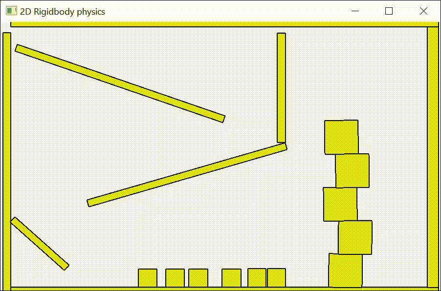
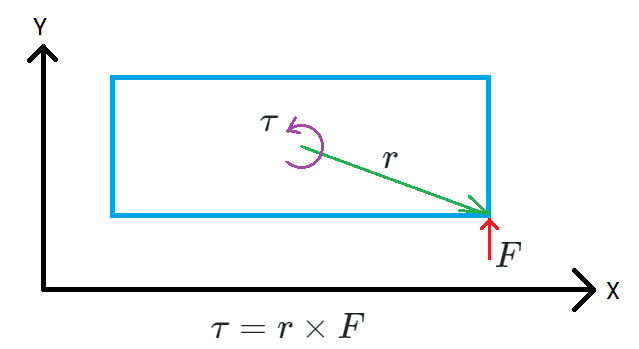

# Small 2D physics engine
This 2D physics engine simulates the movement of boxes through sequential impulses. The goal is to show how a simple 2D physics engine works.
I was inspired by Box2D-Lite, but tried to make it more understandable. 

Video
------


## Explanation how this works
### Move a single box without collisionhandling
If you want to simulate the movement from a 2D-Box then you need at first a datastructure, which holds the width, height, position and rotation from the box which may looks like this:

```csharp
class Box
{
  public float Width = 1;
  public float Height = 1;
  public Vec2D Center = new Vec2D(0,0); //Position from the center from the box
  public float Angle = 0; //Oriantation around the Z-Aches [0..2PI]
}
```

The next think, what you need for showing a movement is a timer-handler, which is called by example every 20 ms. In this function, you change the Center- and Angle-Property from the box and draw the box also.

```csharp
class Main
{
  private Box box = new Box();  

  //This function is called every 20 ms. dt has the value from 20.
  void HandleTimerTick(float dt)
  {
     box.Center.Y += 1; //Move the box downwards. (0,0) is the upper left corner from the window.
     box.Angle = 0; //no rotation at the moment
     DrawBox(box); //shows the box on the screen
  }
}
```

This function would make the box fall evenly downwards. But here we would like to use Newton’s physical laws for the movement. This means we want to use the formula $F = m * a$. In our case we have only want to use the the gravity with a=9.81. The box needs at next a Mass-Property which will be the m-variable in the formular. The Gravity-force F will produce a acceleration of $a = \frac{F}{m}$. Acceleration is defined as the rate of change of velocity with respect to time. The second derivative of the position x also gives the acceleration. $a=\frac{dv}{dt}=\dot{v}=\ddot{x}$. The next think which we need to describe the current state from our box is the velocity. 
Our new box-class looks now like this:

```csharp
class Box
{
  public float Width = 1;
  public float Height = 1;
  public Vec2D Center = new Vec2D(0,0); //Position from the center from the box. Symbol: x
  public float Angle = 0; //Oriantation around the Z-Aches [0..2PI] Symbol: Phi
  public float Mass = 1; //Symbol: m
  public Vec2D Velocity = new Vec2D(0,0);  //Symbol: v
}
```
The $F = m * a$-formular is a differential equation which can be solved with the Semi-implicit Euler method to get the position from each timestep. To use Semi-implicit Euler you have a x- and v-variable. Then you calculate at first the new value for velocity v and after this the new value for position x. You only use this two formulars if you use the time step size h:

```math
\begin{align}v_2 &= v_1 * \frac{F}{m} * h \\ x_1 &= x_1 + v_2 * h \end{align}
```

The new function, which will move our box with semi-implicit euler looks like this now:
```csharp
class Main
{
  private Box box = new Box();  
  private float gravity = 9.81f; //a=9.81

  //This function is called every 20 ms. dt has the value from 20.
  void HandleTimerTick(float dt)
  {
     Vec2D gravityForce = new Vec2D(0, gravity) * box.Mass; //F=m*a with a=gravity and m=box.Mass
     Vec2D acceleration = gravityForce / box.Mass;

     //Semi-Implicit-Euler
     box.Velocity += acceleration * dt; //v2 = v1 + F/m * dt
     box.Center += box.Velocity * dt;   //x2 = x1 + v2 * dt

     DrawBox(box); //shows the box on the screen
  }
}
```

In this example the box can only falling downwards but there is no rotation at the moment. If you want to accelerate the box in a certain direction you whould apply a translation-force on the center from the box as in the example above with the gravity. The mass from the box determines, how strongly the box resists a change in speed. If you applied the force to a different point than the center, the box would also experience a change in rotation/angle.

The [Torque](https://en.wikipedia.org/wiki/Torque) is defined with $\tau = r \times F$ which is a force, which will rotate the body around his center.


r is the leverage, which points from the centroid to the point where the force f is applied.

Similar to the $F = m * a$ rule there is also for the torque the $\tau = I * \alpha$ rule where I is the [moment of inertia](https://en.wikipedia.org/wiki/Moment_of_inertia) and $\alpha$ is the [angular acceleration](https://en.wikipedia.org/wiki/Angular_acceleration)

The moment of inertia defines how hard it is to change the angular velocity of a rigid body for a given rotation axis. We want to rotate a 2D-rectangle which is on the XY-plane. This means we will rotate the rectangle around the Z-Axis which goes through the rectangle-center. 

For the simple 2D-case we can use this [formular](https://www.toptal.com/game/video-game-physics-part-i-an-introduction-to-rigid-body-dynamics)

$$I = \int_V p(r) r^2 dV$$

where we integrate over all points from the shape. r is a vector from the center to each point from V and p(r) is the density at each point.

If we calculate this for a rectangle with constant density c, whose center is at (0,0) and which has a width of w and a height of h, then we get:

```math
\begin{align}
I&=\int_{-\frac{w}{2}}^{\frac{w}{2}} \int_{-\frac{h}{2}}^{\frac{h}{2}} c * (x^2 + y^2) dx dy \\
I&=c * \int_{-\frac{h}{2}}^{\frac{h}{2}} \left[\frac{1}{3}x^3 + xy^2 \right]_{-\frac{w}{2}}^{\frac{w}{2}} dy \\
I&=c * \int_{-\frac{h}{2}}^{\frac{h}{2}} (\frac{1}{3}\frac{w^3}{8} + \frac{w}{2}y^2) - (-\frac{1}{3}\frac{w^3}{8} - \frac{w}{2}y^2) dy \\
I&=c * \int_{-\frac{h}{2}}^{\frac{h}{2}} \frac{1}{3}\frac{w^3}{4} + wy^2 dy \\
I&=c * \left[ \frac{w^3}{12}y + \frac{1}{3}wy^3 \right]_{-\frac{h}{2}}^{\frac{h}{2}} \\
I&=c *  (\frac{w^3}{12}\frac{h}{2} + \frac{1}{3}w\frac{h^3}{8}) - (-\frac{w^3}{12}\frac{h}{2} - \frac{1}{3}w\frac{h^3}{8}) \\
I&=c *  (\frac{w^3}{12}h + \frac{h^3}{12}w)
\end{align}
```

The mass is the integral over all points which means 
```math
\begin{align}
m &= \int_0^w\int_0^h c * dx dy \\
m &= c * w * h 
\end{align}
```

So we get $c=\frac{m}{wh}$ which we can insert into I:

```math
\begin{align}

I&=\frac{m}{wh} *  (\frac{w^3}{12}h + \frac{h^3}{12}w) \\
I&=m *  (\frac{w^2}{12} + \frac{h^2}{12}) \\
I&= m \frac {w^2 + h^2}{12}
\end{align}
```

Similar to the $a=\frac{dv}{dt} = \dot v_{}$  rule for linear movements we use $\alpha = \frac{d \omega}{dt} = \dot \omega$ for rotational movements where $\omega$ is the [angular velocity](https://en.wikipedia.org/wiki/Angular_velocity)

To describe the current state from a rigid body, which should be a rectangle with constant density, we use now this class:
```csharp
class RigidRectangle
{
  public float Width = 1;
  public float Height = 1;
  public Vec2D Center = new Vec2D(0,0); //Position from the center from the box. Symbol: x
  public float Angle = 0; //Oriantation around the Z-Aches [0..2PI] Symbol: Phi
  public Vec2D Velocity = new Vec2D(0,0);  //Symbol: v
  public float AngularVelocity = 0; //Symbol: Omega
  public float Mass = 1; //Symbol: m
  public float Inertia = 1; //Symbol: I

  public RigidRectangle(float width, float height, float density)
  {
    this.Width = width;
    this.Height = height;
    this.Mass = width * height * density;
    this.Inertia = Mass * (width * width + height * height) / 12;
  }
}
```

With this class, we can simulate the movement from a box, where the gravity force is applied to the center from the box and where a other force is applied to a ordinary point on the box. In this example the extern force could be a thruster which pushes the body on the right side upwards. The thruster pushes the box on the point 'box.Center + new Vec2D(10,0)' and the leverage r to this point is 'new Vec2D(10,0)'. A force $F_{ext}$, which is applied to a point outside the centroid from a body acts in two ways. It creates a linear acceleartion defined by $\dot v = \frac{F_{ext}}{m}$ which will move the center and a angular acceleration defined by $\dot \omega = {\frac{r \times F_{ext}}{I}}_{}$ which will change the angular velocity.


```csharp
class Main
{
  private Box box = new Box();  
  private float gravity = 9.81f; //a=9.81

  //This function is called every 20 ms. dt has the value from 20.
  void HandleTimerTick(float dt)
  {
     //Use gravity-acceleration to change the velocity
     box.Velocity.Y += gravity * dt; 

     //Use a extern force, which directs to 'forceDirection' and is applied to a anchorpoint 'pointOnBox' to update the velocity
     //calculate linearAcceleration and angularAcceleration
     Vec2D pointOnBox = box.Center + new Vec2D(10,0);
     Vec2D forceDirection = new Vec2D(0, -1); //The length from this vector defines the strength from the extern force
     Vec2D r = pointOnBox - box.Center;
     float torque = Vec2D.ZValueFromCross(r, forceDirection); //torque = r.X * forceDirection.Y - forceDirection.X * r.Y;
     Vec2D linearAcceleration = forceDirection / box.Mass;
     float angularAcceleration = torque / box.Inertia;

     //calculate new velocity-values from extern force
     box.Velocity += linearAcceleration * dt;
     box.AngularVelocity += angularAcceleration * dt;
     
     //update position and angle from the box
     box.Center += box.Velocity * dt;
     box.Angle += box.AngularVelocity * dt;

     DrawBox(box); //shows the box on the screen
  }
}
```

### Collisiondetection

This box-movement is nice but at the moment we have no ground. So this means the box would falling down and leave the window. To avoid this we need at next a second box, which should not be moveable. To simulate a box, which is not moveable we can set the mass from the box to infinity. For the calculus of the acceleration we have to divide the force/torque by the mass/inertia. If the mass and inertia is infinity then the the acceleration would be zero and this means there is no position/angle-change. Instead dividing with the mass we can also multiply with the inverse mass. If the mass becomes infinity then the inverse mass becomes zero.

Our new setup with inverse masses becomes to:

```csharp
class RigidRectangle
{
  ...
  public float InverseMass = 1; //Symbol: 1/m
  public float InverseInertia = 1; //Symbol: 1/I

  public RigidRectangle(float width, float height, float density)
  {
    if (density == float.MaxValue)
    {
       this.InverseMass = this.Inertia = 0; //infinity mass
    } else
    {
      float mass = width * height * density;
      float inertia = mass * (width * width + height * height) / 12;

      this.InverseMass = 1.0f / mass;
      this.InverseInertia = 1.0f / inertia;
    }
  }
}
...
  Vec2D linearAcceleration = forceDirection * box.InverseMass;
  float angularAcceleration = torque * box.InverseInertia;
```

The next think what we need to let to box falling down on the ground is a function, which determines all collision-points between two boxes. A collision-point is a data structure, which looks like this:


The start- and end-point from the CollisionInfo-object are the anchorpoints. A force will then act at these points to push the bodys in normal-direction apart. Box 1 is pushed upwards on the start-point in +normal-direction and box 2 is pushed on the end-point downwards in -normal-direction.

The collision-function checks for each edge-point from a box, if it is inside the other box. If so then it checks, which side from the other box has the smallest distance to this point. The normal from this side defines the normal from the CollisionInfo-object.

In code this means:
```csharp
CollisionInfo[] GetCollisionPoints(RigidRectangle box1, RigidRectangle box2)
{
  List<CollisionInfo> list = new List<CollisionInfo>();

  foreach (var point in box1.EdgePoints)
  {
     if (IsPointInsideBox(point, box2)
     {
         var side = GetSideFromBoxWherePointIsClosedTo(point, box2);
         list.Add(new CollisionInfo(){ Start = point, Normal = side.Normal, End = side.PointOnSide } 
     }
  }

  foreach (var point in box2.EdgePoints)
  {
     if (IsPointInsideBox(point, box1)
     {
         var side = GetSideFromBoxWherePointIsClosedTo(point, box1);
         list.Add(new CollisionInfo(){ Start = point, Normal = side.Normal, End = side.PointOnSide } 
     }
  }

  return list.ToArray();
}
```
If you have a list of multiple boxes, then you have to check for every box-pair, if there a collisionpoints available. You do this by two nested loops.
If both bodies (boxes) not moveable then you don't need a collision-check. You can speed up the process, that before calling the GetCollisionPoints-function, you check if the bounding-circles overlaps:


In the broadphase you detect, which body-pairs could be overlap and in the nearphase you check, which bodys are realy have collisionpoints.

```csharp
public static CollisionInfo[] GetAllCollisions(List<RigidRectangle> bodies)
 {
     List<CollisionInfo> collisions = new List<CollisionInfo>();

     for (int i = 0; i < bodies.Count; i++)
         for (int j = i + 1; j < bodies.Count; j++)
         {
             var b1 = bodies[i];
             var b2 = bodies[j];
             if (b1.InverseMass == 0 && b2.InverseMass == 0) continue; //No collisionpoint between non moveable bodies

             if (BoundingCircleCollides(b1, b2))   //Broudphase-Test
             {
                 var contacts = GetCollisionPoints(b1, b2); //Nearphase-Test
                 if (contacts.Any())
                     collisions.AddRange(contacts);
             }
         }

     return collisions.ToArray();
 }
```

### Collisionresolution

#### Derivation of the constraint impulse

We have now the possibility to simulate a box, which is falling down and to place a fixed box as ground. We can also detect, if there are collisionpoints between the falling box and the ground. The next think, what we need is a function, which calculate for each collisionpoint a force, which will push the two boxes apart so that the falling box will not sink in the ground. 

For each collision-point there are two kind of forces: 
* NormalForce = Force, which pushes two anchor points between two bodies in collision-normal-direction apart
* FrictionForce = Force which pushes the anchor points in tangent-direction. It slows down the movement in tangent-direction.  

If you want to simulate a cube sitting moveless on a slope then you have 5 force-vectors, which will hold the cube in calm.


The gravity pushes the cube downwards. The resulting forces on the two collisionpoints press the cube upwards so that the resulting velocity is zero.

The gravity-force is called "extern force" and looks like this: 

```math
 f_{ext} = 
 \begin{bmatrix}
  0 \\
  9.81
 \end{bmatrix}
```

There is no extern force, which will rotate the box so $\tau_{ext}=0$

The resulting forces on the collisionpoints are called constraint-forces. Each force is applied to a anchorpoint and pushes the cube in normal- or tangent-direction and caused a translation-force and a torque. You have to sum these forces for the cube:

$f_C = f_{N1} + f_{F1} + f_{N2} + f_{F2}$

$\tau_C=r_1 \times f_{N1} + r_1 \times f_{F1} + r_2 \times f_{N2} + r_2 \times f_{F2}$

If you know $f_{N1}$, $f_{F1}$, $f_{N2}$, $f_{F2}$ then you can calculate $f_C$ and $\tau_C$ and also the resulting velocity / angular velocity from the box by using these formulars

$m \dot v = f_C + f_{ext}$

$I \dot \omega = \tau_C + \tau_{ext}$

$\dot v = \frac{v_2 - v_1}{\Delta t}$

$\dot \omega = \frac{\omega_2 - \omega_1}{\Delta t}$

Where $v_1$ / $\omega_1$ is the velocity / angular velocity from the box before applying the gravity- and constraint-force.

$v_2$ / $\omega_2$ is the velocity / angular velocity from the box after applying the gravity- and constraint-force.

At the moment $f_C$ and $\tau_C$ is unknown so we can not determine $v_2$ and $\omega_2$.

To derivate a formular, which calculates $f_C$ and $\tau_C$ we need a function, which measures how far the contactpoint from one box is entered into the side from the other box. 

To derive this function we use as example two boxes where a collision point was found (left side from the image):


The collisiondetection-routine creates a CollisionInfo-object which contains a Start- and End-Point. To push the boxes with a force apart we need a common point, which is called ContactPoint. This point is located between the Start- and End-Point. We found the point by this function:

```csharp
public static Vec2D GetContactPoint(CollisionInfo c)
{
    Vec2D start = c.Start * (c.B2.InverseMass / (c.B1.InverseMass + c.B2.InverseMass));
    Vec2D end = c.End * (c.B1.InverseMass / (c.B1.InverseMass + c.B2.InverseMass));
    return start + end;
}
```
See: https://github.com/XMAMan/SmallSI/blob/master/Source/Physics/CollisionResolution/ResolutionHelper.cs
 
The mass is used as weighting-factor. If box 1 has more weight then box 2, then the ContactPoint is then closer to c.Start.

$r_1$ directs from the center from box 1 to the contact point and $r_2$ directs from the center from box 2 also to the same contact point.

The anchor point from box 1 is defined by $x_1 + r_1$ and the anchor point from box 2 by $x_2 + r_2$

We will now define a function $C_n$ which measures how far into normaldirection the anchor point from box 2 enters into the upper edge from box 1:

$$C_n = (x_2 + r_2 - x_1 - r_1) * n_1$$

If you assume that $r_1$ points to c.Start and $r_2$ to c.End then this function would measure how many pixels enters the edge from box 1 into the side from box 2. In our case we have defined that $r_1$ and $r_2$ both points to ContactPoint. We only need the derivation from $C_n$ so for this case it is ok, if $C_n$ don't measure the distance between c.Start and c.End but instead the distance between two anchor points, which both lies on the same location.

We now want to derive this function with respect to time. We need these two rules for this:

Derivative rule for a moving point $x(t)$: $\dot x(t) = v(t)$

Derivative rule for a moving lever from a body with angular velocity $\omega$: $\dot r = \omega \times r$

The derivative of C with respect to time is now as follows:

```math
 \dot C_n(v_1, \omega_1, v_2, \omega_2)=(v_2 + \omega_2 \times r_2 - v_1 - \omega_1 \times r_1)*n_1 + (x_2 + r_2 - x_1 - r_1)* (\omega_1 \times n_1)
```
$\dot C_n$ measures the speed at which the collision points move towards each other in the direction of the collision normal. It receives the velocity values ​​of both cubes as input. We now simplify the function by omitting the second plus term, since we have defined the ContactPoint in this way, that $r_1$ and $r_2$ points to the same point. Therefore $(x_2 + r_2 - x_1 - r_1)$ is zero. 

$\dot C_n(v_1, \omega_1, v_2, \omega_2)=(v_2 + \omega_2 \times r_2 - v_1 - \omega_1 \times r_1)*n_1$ -> take $n_1$ into the brackets

$\dot C_n(v_1, \omega_1, v_2, \omega_2)=v_2 n_1 + (\omega_2 \times r_2) n_1 - v_1 n_1 - (\omega_1 \times r_1) n_1$ -> use the rule: $a*(b \times c)=(a \times b)*c$

$\dot C_n(v_1, \omega_1, v_2, \omega_2)=v_2 n_1 + \omega_2 (r_2 \times n_1) - v_1 n_1 - \omega_1 (r_1 \times n_1)$ -> sort in the order $v_1$, $\omega_1$, $v_2$, $\omega_2$ 

$\dot C_n(v_1, \omega_1, v_2, \omega_2)= - v_1 n_1 - \omega_1 (r_1 \times n_1) + v_2 n_1  + \omega_2 (r_2 \times n_1)$ -> write as vector product

```math
\dot C_n(v_1, \omega_1, v_2, \omega_2)= J \cdot V =
 {\begin{bmatrix}
  -n_1^T \\
  -r_1 \times n_1 \\
  n_1^T \\
  r_2 \times n_1
 \end{bmatrix}}^T
\begin{bmatrix}
v_1 \\
\omega_1 \\
v_2 \\
\omega_2
\end{bmatrix}
```

 This function can now be used to define a requirement how the velocity from both cubes should be after applying the gravity and normal-force. To do this we define the column vector $V_1$ with 
```math
 V_1= \begin{bmatrix}
v_1 \\
\omega_1 \\
v_2 \\
\omega_2
\end{bmatrix}
```
$V_1$ saves the velocity from both cubes before applying the gravity and normal-force. It contains 6 scalar values: $v_{1x}, v_{1y}, \omega_1, v_{2x}, v_{2y}, \omega_2$

$V_2$ is simular defined but contains the velocity from both cubes after applying the gravity and normal-force.

The still unknown $V_2$ should satisfies the following equation:

${J \cdot V_2 = -J \cdot V_1 * e}$ -> This is our NormalConstraint with Restitution e(=0..1)

This means if the contact points between two bodies move by example with a speed from 5 in normal-direction then the resulting velocity from both bodies should be such that the speed in normal direction from the contant-points are -5*e after applying the normal-constraint-force.

We also want a Friction-force which pushes in tangent direction $t_1$
```math
t_1=\begin{bmatrix} -n_{1x} \\ n_{1y} \end{bmatrix}
```

For the frictionconstraint we use the same derivation as for the normalconstraint:

```math
\dot C_t(v_1, \omega_1, v_2, \omega_2)= J \cdot V =
 {\begin{bmatrix}
  -t_1^T \\
  -r_1 \times t_1 \\
  t_1^T \\
  r_2 \times t_1
 \end{bmatrix}}^T
\begin{bmatrix}
v_1 \\
\omega_1 \\
v_2 \\
\omega_2
\end{bmatrix}
```

Friction tries to bring the relative velocity from the contactpoints in the tangent direction to zero. For our example, where the cube is moveless resting on a slope we want, that $V_2$ satisfy the following equation:

${J \cdot V_2 = 0}$ -> This is our FrictionConstraint. It says that there should not be a movement in tangent-direction after collision resolution.

In our example with the cube on slope we have two collisionpoints and each collisionpoint has a normal- and frictionforce. This means we have 4 Constraint-Equations which all looks like this:

```math
J \cdot V_2 = \xi
```

$\xi$ is a value specified by me which determines the relative velocity of the contact points after the constraint force is applied. For the FrictionConstraint I have defined $\xi=0$ and for the NormalConstraint $\xi=-J \cdot V_1 * e$. If you take a close look to the equation $J * V_2 = \xi$ then you will notice, that this is a equation for a plane in [Hesse normal form](https://en.wikipedia.org/wiki/Hesse_normal_form)
```math
\vec{r} \cdot \vec{n}_0 - d = 0
```

where $\vec{n}_0$ is the normal from the plane and $d$ is the distance to the origin. $\vec{r}^{}$ are all points, which lies on the plane. For our Constraint this means J is the normal from the plane and $\xi$ is the plane distance to the origin. $V_2$ are all points which are located on the plane. Because J und $V_2$ are vectors with 6 scalar entries this means this is a 6 dimensional hyperplane.  

You can imagin this Constraint-plane as a black line.


$V_1$ is a column vector with 6 entries which represents the velocity-values from two bodies after we have detected a collisionpoint between this two bodies and before we have applied any correction-force, which would push these bodies apart. We now want to apply a force to the two contact points from these bodies so that the resulting velocity $V_2$ match the constraint-equation $J \cdot V_2 = \xi$. The shortest way to get from $V_1$ a point $V_2$ on the plane is to go in J-Direction. J is a row-vector and V a column vector. If you transpose J then it is also a column vector. $J^T$ is parallel to the $(V_2 - V_1)$-direction. Because of this you can use the formular $V_2 = V_1 + J^T \cdot \lambda$ with scalar $\lambda$ to calculate $V_2$. If you want to move two contact points in contact point normal/tangent-direction then it means you have to push the contactpoints in $J^T$ direction. 

J is a 6 dimensional vector. How can it be a 2D-forcedirection? To understand this imagin you have the J from the normalconstraint and want to push the anchorpoint from body 1 in $-n_1$-direction and the anchorpoint from body 2 in $n_1$-direction. A force, which is applied to a anchorpoint is split into a translation-force and torque:

```csharp
//Body 1:
Vec2D linearForce1 = -collisionPoint.Normal;
float torque1 = -Vec2D.ZValueFromCross(r1, collisionPoint.Normal);
Vec2D linearAcceleration1 = linearForce1 * dt;
float angularAcceleration1 = torque1 * dt;

//Body 2:
Vec2D linearForce2 = +collisionPoint.Normal;
float torque2 = Vec2D.ZValueFromCross(r2, collisionPoint.Normal);
Vec2D linearAcceleration2 = linearForce2 * dt;
float angularAcceleration2 = torque2 * dt;
```

Now take a look on J. You see that the first field from J contains the value from linearForce1. The second from torque1. The third from linearForce2 and the forth from torque2.

```math
J =
 {\begin{bmatrix}
  -n_1^T \\
  -r_1 \times n_1 \\
  n_1^T \\
  r_2 \times n_1
 \end{bmatrix}}^T
```

In this example you see, that J is always in this form, that it contains a force, which is applied on two anchorpoints from two bodys. 

We can now define the constraint-force-direction by $F_C=J^T$ which will applied to two anchorpoints. We only need for each constraint the unknown $\lambda$ to calculate the length of all constraint-forces. 

From [newton's law](https://en.wikipedia.org/wiki/Newton%27s_laws_of_motion) we know that the impulse is defined by $p=m \Delta v$ with $\Delta v=v_2 - v_1$ and if you apply a constant force F over $\Delta t$ seconds you get also the impulse $p=F \Delta t$

That means, if you have a body with current velocity $v_1$ and you apply a force F for $\Delta t$ seconds then his velocity would be changed by $\Delta v$. If you use the term $J^T \cdot \lambda$ then $\lambda$ could be the forcelength but because of the $p=F \Delta t$-rule $\lambda$ could also be the product from the constraint-forcelength and the constraint-impulse-durration. In our case we only need a impulse so we define the constraint-impulse by $p_C = J^T \cdot \lambda$.

For the impluse you can write $p=m * (v_2 - v_1)$. If you rearrange this equation to $v_2$ you get $v_2 = \frac{p}{m} + v_1$

If we want to express the $v_2 = \frac{p}{m} + v_1$-term for the constraint-impulse $p_C$ then m must be a 6 by 6 matrix and $v_1$ and $v_2$ must be 6 dimensional column-vectors.

To use the constraint-impulse $p_C = J^T \cdot \lambda$ we define:

```math
M =
 \begin{bmatrix}
  m_1 & 0 & 0 & 0 & 0 & 0 \\
  0 & m_1 & 0 & 0 & 0 & 0 \\
  0 & 0 & I_1 & 0 & 0 & 0 \\
  0 & 0 & 0 & m_2 & 0 & 0 \\
  0 & 0 & 0 & 0 & m_2 & 0 \\
  0 & 0 & 0 & 0 & 0 & I_1
 \end{bmatrix}
```

$m_1$ is the mass from body 1 and $m_2$ is the mass from body 2. $I_1$ is the inertia from body 1 and $I_2$ from body 2.

M is a diagonal matrix so we get the inverse by 

```math
M^{-1} =
 \begin{bmatrix}
  m_1^{-1} & 0 & 0 & 0 & 0 & 0 \\
  0 & m_1^{-1} & 0 & 0 & 0 & 0 \\
  0 & 0 & I_1^{-1} & 0 & 0 & 0 \\
  0 & 0 & 0 & m_2^{-1} & 0 & 0 \\
  0 & 0 & 0 & 0 & m_2^{-1} & 0 \\
  0 & 0 & 0 & 0 & 0 & I_1^{-1}
 \end{bmatrix}
```

We define also
```math
 V = 
 \begin{bmatrix}
  v_{1x} \\
  v_{1y} \\
  \omega_1 \\
  v_{2x} \\
  v_{2y} \\
  \omega_2
 \end{bmatrix}
```

which is the velocity from two bodies.

We use now the following equations to get the value for $\lambda$

$V_2 = V + M^{-1} \cdot p_C$ (1) -> This comes from the $p=m*\Delta v$- and $v_2 = \frac{p}{m} + v_1$-rule.

$p_C = J^T \cdot \lambda$ (2) -> The constraint-force-direction is parallel to the constraint-impulse. $\lambda$ is the product of forcelength and impulse durration

$J \cdot V_2 = \xi$ (3) -> This is our constraint-equation where $V_2$ should be a point on the constraint plane

Equation (1) is substituted for V2 in equation (3):

$J \cdot (V + M^{-1} \cdot p_C) = \xi$ -> multiply with J

$J \cdot V + J \cdot M^{-1} \cdot p_C = \xi$ -> replace $p_C$ with (2)

$J \cdot V + J \cdot M^{-1} \cdot J^T \cdot \lambda = \xi$ -> minus $J \cdot V$

$J \cdot M^{-1} \cdot J^T \cdot \lambda = \xi - J \cdot V$ -> divide with $J \cdot M^{-1} \cdot J^T$

$\lambda = \frac{\xi - J \cdot V}{J \cdot M^{-1} \cdot J^T}$

$\lambda$ is a scalar value and we can now use it to calculate the constraint-impulse with (2):

$p_C = J^T \cdot \frac{\xi - J \cdot V}{J \cdot M^{-1} \cdot J^T}$ (4)

If you have only one constraint then formula (4) could be used to correct the velocity from two bodies. If you think on the example with the cube sitting on a slope then we have 4 constraints between two bodies. This means we are looking for a point $V_2$ that satisfies all 4 constraints. This $V_2$ must be located on all 4 constraint-planes. Such a point can only be found if all four planes intersect at a common point. We assume that this condition is met. You can find the $V_2$-point if you sequentiell apply the impulse from all constraints. If you do this many iterations then you find the $V_2$ which is located on all constraint-planes. To get an understanding from this idea take a look on the following image where two constraints are given.


You start on $V_1$. Applying the first impulse for constraint 1 which will correct the velocity-values from the two associated bodys for this constraint. Then you use the corrected velocitys which is the V in formula (4) and use the impulse from constraint 2.

If you want to use formula (4) then you have to calculate $\frac{1}{J \cdot M^{-1} \cdot J^T}$. This term is called effective Mass. For the normal constraint the calculation from the $J \cdot M^{-1} \cdot J^T$-term is:


Despite we are working here with vectors and a matrix the resulting term is a scalar value (green marked).

#### Using the constraint impulse in code

With this knowledge you should now be able to understand the initialisation from the EffectiveMass-property from the NormalConstraint-class:

```csharp
public NormalConstraint(Settings settings, CollisionInfo c)
{
    Vec2D p = ResolutionHelper.GetContactPoint(c);

    this.B1 = c.B1;
    this.B2 = c.B2;
    this.R1 = p - c.B1.Center;
    this.R2 = p - c.B2.Center;
    float r1crossN = Vec2D.ZValueFromCross(R1, c.Normal);
    float r2crossN = Vec2D.ZValueFromCross(R2, c.Normal);

    this.EffectiveMass = 1.0f / (B1.InverseMass + B2.InverseMass +
        r1crossN * r1crossN * B1.InverseInertia +
        r2crossN * r2crossN * B2.InverseInertia);
}
```
See: https://github.com/XMAMan/SmallSI/blob/master/Source/Physics/CollisionResolution/NormalConstraint.cs

The next term from formular (4) is $J \cdot V$. We know from the velocity constraint derivation that $\dot C_n(v_1, \omega_1, v_2, \omega_2)= J \cdot V$ is a function which measure the relative velocity between two anchorpoints in normal/tangent-direction. 

The velocity from a anchorpoint p, where the body center moves with v and rotates with $\omega$ and r points to the anchorpoint is defined by $\dot{p}=v + \vec{\omega} \times r$. See [David Baraff 2-7](https://www.cs.cmu.edu/~baraff/sigcourse/notesd1.pdf)

This means:
```math
\dot{p} = 
 \begin{pmatrix}
  v_x \\
  v_y \\
  0
 \end{pmatrix}
+
\begin{pmatrix}
  0 \\
  0 \\
  \omega
 \end{pmatrix}
\times
\begin{pmatrix}
  r_x \\
  r_y \\
  0
 \end{pmatrix}
=
\begin{pmatrix}
  v_x \\
  v_y \\
  0
 \end{pmatrix}
+
\begin{pmatrix}
  -\omega r_y \\
  \omega r_x \\
  0
 \end{pmatrix}
```

If we want to calculate $\dot{p}_2 - \dot{p}_1$ then we use this function:

```csharp
public static Vec2D GetRelativeVelocityBetweenAnchorPoints(RigidRectangle b1, RigidRectangle b2, Vec2D r1, Vec2D r2)
{
    Vec2D v1 =b1.Velocity + new Vec2D(-b1.AngularVelocity * r1.Y, b1.AngularVelocity * r1.X);
    Vec2D v2 =b2.Velocity + new Vec2D(-b2.AngularVelocity * r2.Y, b2.AngularVelocity * r2.X);
    return v2 - v1;
}
```
See: https://github.com/XMAMan/SmallSI/blob/master/Source/Physics/CollisionResolution/ResolutionHelper.cs

Relative velocity with respect to direction $n$ means we project the velocity-vector to a direction with the dot-product $(\dot{p}_2 - \dot{p}_1) \cdot n$ and this is the same as writing $J \cdot V$

In the normal constraint the $\xi$-term is called bias and this term is defined by $\xi=-J \cdot V_1 * e$

In the code this term is called restitutionBias and is calculated as follows:

```csharp
// Relative velocity in normal direction
Vec2D relativeVelocity = ResolutionHelper.GetRelativeVelocityBetweenAnchorPoints(c.B1, c.B2, r1, r2);
float velocityInNormal = relativeVelocity * c.Normal; //this is the same as writing J*V1
float restituion = System.Math.Min(c.B1.Restituion, c.B2.Restituion);

float restitutionBias = -restituion * velocityInNormal;
```
See: https://github.com/XMAMan/SmallSI/blob/master/Source/Physics/CollisionResolution/NormalConstraint.cs

If you now look again at formular (4) then we have translated this
$p_C = J^T \cdot \frac{\xi - J \cdot V}{J \cdot M^{-1} \cdot J^T}$ (4)

Into this:
```csharp
Vec2D relativeVelocity = ResolutionHelper.GetRelativeVelocityBetweenAnchorPoints(c.B1, c.B2, c.R1, c.R2);
float velocityInForceDirection = relativeVelocity * c.ForceDirection; //this is the same as J*V
float impulse = c.EffectiveMass * (c.Bias - velocityInForceDirection); //lambda=forceLength*impulseDuration

//Apply Impulse -> correct the velocity from B1 and B2
Vec2D impulseVec = impulse * c.ForceDirection;
c.B1.Velocity -= impulseVec * c.B1.InverseMass;
c.B1.AngularVelocity -= Vec2D.ZValueFromCross(c.R1, impulseVec) * c.B1.InverseInertia;
c.B2.Velocity += impulseVec * c.B2.InverseMass;
c.B2.AngularVelocity += Vec2D.ZValueFromCross(c.R2, impulseVec) * c.B2.InverseInertia;
```
See: https://github.com/XMAMan/SmallSI/blob/master/Source/Physics/PhysicScene.cs

Where $\frac{1}{J \cdot M^{-1} \cdot J^T}$ is the EffectiveMass, $\xi$ is Bias and $J \cdot V$ is velocityInForceDirection.
$\frac{\xi - J \cdot V}{J \cdot M^{-1} \cdot J^T}$ is a scalar and is named with the impulse-variable and applying this constraint-impuls means, that you push the anchor point $x_1 + r_1$ from body 1 in -ForceDirection-direction and the anchor point $x_2 + r_2$ from body 2 in +ForceDirection-direction.

#### Accumulated Impulse

If you now look in the TimeStep-Method from the PhysicScene-class then you might wonder what this lines of code do:

```csharp
// Clamp the accumulated impulse
float oldSum = c.AccumulatedImpulse;
c.AccumulatedImpulse = ResolutionHelper.Clamp(oldSum + impulse, c.MinImpulse, c.MaxImpulse);
impulse = c.AccumulatedImpulse - oldSum;
```
See: https://github.com/XMAMan/SmallSI/blob/master/Source/Physics/PhysicScene.cs

For the normalconstraint the Min-Max-Impulse-propertys are definded with:
```csharp
public float MinImpulse { get; } = 0;
public float MaxImpulse { get; } = float.MaxValue;
```

The normal-constraint should only push to bodys apart but never pull it together. To reach this the impulse must be positiv. So you would now think why not using this line of code?:

```csharp
float impulse = c.EffectiveMass * (c.Bias - velocityInForceDirection);
impulse = ResolutionHelper.Clamp(impulse, c.MinImpulse, c.MaxImpulse);
```

If you would clamp the impulse in this way then the sequentiell impulse algorithm has no chance to correct a impulse, which was to hight.

In this image you see the comparison between right and wrong impulse clamping. The normalconstraint should push a body in left direction. The needet impuls is the blue vector. You apply multiple impulses so that you AccumulatedImpulse match the blue vector. If there are multiple constraints then it can happen, that the current velocity between two bodies becomes too hight and then a correction-impuls in right direction (third impulse in image) is needet. If you use the wrong clamping then you have no chance to correct this and the sum over all impulses (AccumulatedImpulse) remains too high.


The first and second impulse (black arrow) is the same between the two variations. After the second impulse the velocity becomes too hight. The upper (right) variation can create a impulse pointing in right direction because the AccumulatedImpulse still points leftward. The lower (false) variation creates no third impulse. So the velocity remains to hight. That is the reason, why we use the clamping for the impulse-sum but not for the single-impulse. 

#### Position correction
The next unknown think in code are the following lines in the NormalConstraint-class:

```csharp
float biasFactor = s.DoPositionalCorrection ? s.PositionalCorrectionRate : 0.0f;
float positionBias = biasFactor * s.InvDt * System.Math.Max(0, c.Depth - s.AllowedPenetration);
```

With the normal constraint ${J \cdot V_2 = -J \cdot V_1 * e}$ we determine which relative speed the contact points should have after the correction.
However, we are currently not specifying what the distance between the anchor points should be. Imaging we have a box with restitution e=0 which is falling down on the ground. In each timestep the box moves a certain distance. If the collision routine now detects, that the box is inside the ground the box will be in the ground with a certain distance.

In this example two collision-points are detected and each point has the distance 'Depth' between the anchorpoints:


Because of the restitution of zero the normal constraint for both collisionpoints will bring the velocity from the box to zero but the box then remains stuck in the ground.

To correct this, a extra impulse is needet, which pushes the box out of the ground. 

The box is moved in each timestep by 'body.Velocity * dt' If you want to move the box 10 pixels upwards then 'body.Velocity*dt' must be 'new Vec2D(0, -10)' that means body.Velocity must be 'new Vec2D(0, -10) / dt'. Because of this the positionBias contains the follwing term: 

```csharp
s.InvDt * c.Depth
```
This will move the box by c.Depth pixels in collisionpoint-normaldirection.

The next think is that you must not press the box exactly on the top edge otherwise the contact points will be lost. If this happens the box will falling down for one TimeStep and this causes the box to jump a little bit. The AllowedPenetration determines how many pixels below the top edge the box is pushed.

Thats the reason for: System.Math.Max(0, c.Depth - s.AllowedPenetration)

This lines of code now means, that the box is pushed AllowedPenetration pixels below the top edge from the ground:
```csharp
float positionBias = s.InvDt * System.Math.Max(0, c.Depth - s.AllowedPenetration);
```

The next think is the PositionalCorrectionRate. Imagine there is a ball-stack. If you use a PositionalCorrectionRate from 1 the ground will push the lower ball upwards into the upper ball and this will give the upper ball a impulse upwards so that he is thrown away.
If the PositionalCorrectionRate is instead 0.2 then the correction will take place several time steps and in this case the ball stack stands calm.


The last think is the DoPositionalCorrection-switch. If you want to simulate a jumping-ball/cube with restituion from 1 then position correction would give the ball at each bounce a extra impulse. This means that the ball gets higher with each jump. If you want to simulate a jumping ball with  restituion 1 then you would set DoPositionalCorrection to false.


#### Note on gravity

The last think is the gravity-force. We have now a way to use constraint-impulses to push overlapping bodies apart and to simulate friction.

If you take a look into the TimeStep-method then there are the following steps:
* Step 1: Get all collisionpoints
* Step 2: Create Constraints
* Step 3: Apply Gravity-Force
* Step 4: Apply Normal- and Friction-Force by using sequentiell impulses
* Step 5: Move bodies

If you would apply the gravity bevore Step 2 then this would change the velocity from each body and in the constructor from each constraint-object the Bias-Function would use a wrong velocity-value to calculate the bias. If you apply gravity after step 4, it will not be taken into account in the constraint loop. The resulting $V_2$ is then wrong. Thats the reason why the gravity is exactly at step 3 after bias-calculation and bevore the constraint-impulse-loop.

I hope this little guide is a good help for understanding how a physics engines works. Let me know if there is something not clear enough.

Related work
------------
* https://github.com/erincatto/box2d-lite

Used Papers/Tutorials/Links
---------------------------
* Rigid Body Simulation - David Baraff 2001
* Iterative Dynamics with Temporal Coherence - Erin Catto 2005
* Constraint based physics solver - Marijn 2015
* Comparison between Projected Gauss-Seidel and Sequential Impulse Solvers for Real-Time Physics Simulations - Marijn 2015
* 3D Constraint Derivations for Impulse Solvers - Marijn 2015
* Soft Constraints - Erin Catto 2011
* Constraint-Based Physics - Ming-Lun Allen Chou 2014
* Building a 2D Game Physics Engine: Using HTML5 and JavaScript (English Edition)
* https://www.toptal.com/game/video-game-physics-part-i-an-introduction-to-rigid-body-dynamics
* https://github.com/erincatto/box2d-lite
* https://github.com/erincatto/box2d
* https://raphaelpriatama.medium.com/sequential-impulses-explained-from-the-perspective-of-a-game-physics-beginner-72a37f6fea05
* https://www.myphysicslab.com/engine2D/collision-en.html
* https://www.myphysicslab.com/engine2D/collision-methods-en.html
* https://www.myphysicslab.com/engine2D/contact-en.html
* https://www.myphysicslab.com/develop/docs/Engine2D.html
* https://research.ncl.ac.uk/game/mastersdegree/gametechnologies/physicstutorials/8constraintsandsolvers/Physics%20-%20Constraints%20and%20Solvers.pdf
* https://www.youtube.com/watch?v=SHinxAhv1ZE
* http://allenchou.net/2013/12/game-physics-resolution-contact-constraints/
* https://web.iit.edu/sites/web/files/departments/academic-affairs/academic-resource-center/pdfs/Moment_Inertia.pdf

Usage
-----
Use visual studio 2022 with .NET 8.0
