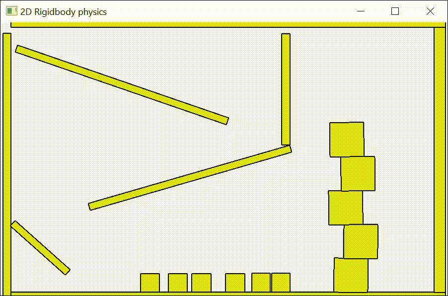

# Small 2D physics engine
This 2D physics engine simulates the movement of boxes through sequential impulses. The goal is to show how a simple 2D physics engine works.
I was inspired by Box2D-Lite, but tried to make it more understandable. 

Video
------

Related work
------------
* https://github.com/erincatto/box2d-lite

Used Papers/Tutorials/Links
---------------------------
* Rigid Body Simulation - David Baraff 2001
* Iterative Dynamics with Temporal Coherence - Erin Catto 2005
* Constraint based physics solver - Marijn 2015
* Comparison between Projected Gauss-Seidel and Sequential Impulse Solvers for Real-Time Physics Simulations - Marijn 2015
* 3D Constraint Derivations for Impulse Solvers - Marijn 2015
* Soft Constraints - Erin Catto 2011
* Constraint-Based Physics - Ming-Lun Allen Chou 2014
* Building a 2D Game Physics Engine: Using HTML5 and JavaScript (English Edition)
* https://www.toptal.com/game/video-game-physics-part-i-an-introduction-to-rigid-body-dynamics
* https://github.com/erincatto/box2d-lite
* https://github.com/erincatto/box2d
* https://raphaelpriatama.medium.com/sequential-impulses-explained-from-the-perspective-of-a-game-physics-beginner-72a37f6fea05
* https://www.myphysicslab.com/engine2D/collision-en.html
* https://www.myphysicslab.com/engine2D/collision-methods-en.html
* https://www.myphysicslab.com/engine2D/contact-en.html
* https://www.myphysicslab.com/develop/docs/Engine2D.html
* https://research.ncl.ac.uk/game/mastersdegree/gametechnologies/physicstutorials/8constraintsandsolvers/Physics%20-%20Constraints%20and%20Solvers.pdf
* https://www.youtube.com/watch?v=SHinxAhv1ZE
* http://allenchou.net/2013/12/game-physics-resolution-contact-constraints/
* https://web.iit.edu/sites/web/files/departments/academic-affairs/academic-resource-center/pdfs/Moment_Inertia.pdf

Usage
-----
Use visual studio 2022 with .NET 8.0